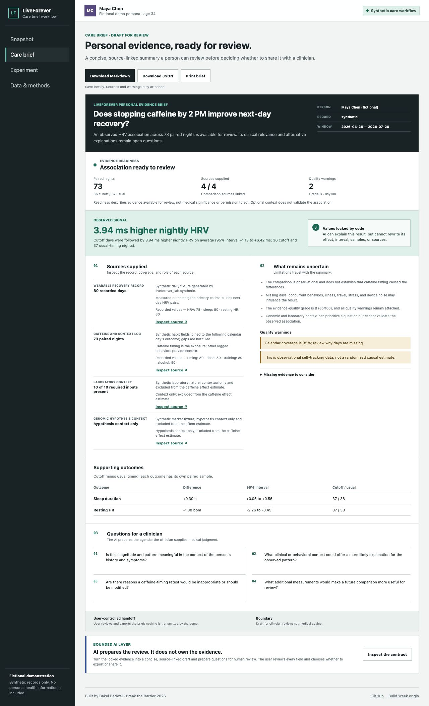
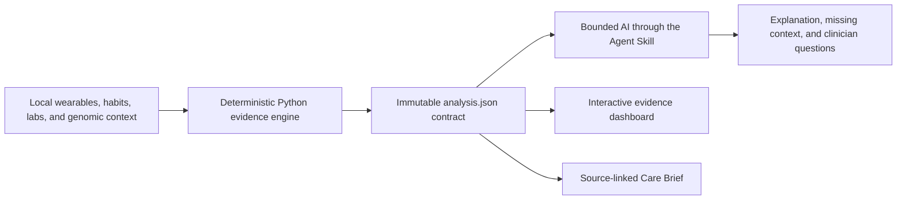

# LiveForever Care Brief

### Personal evidence, ready for review.

> **Pending Break the Barrier 2026 entry** · A local evidence workflow that turns longitudinal health records into a source-linked draft for clinician review.

[](https://bakulbadwal.github.io/liveforever-care-brief/#care)

<sub>Illustrative product scene. The interface and all health records shown in this project use one fictional, fully synthetic persona.</sub>

**[Try the Care Brief](https://bakulbadwal.github.io/liveforever-care-brief/#care)** · [Product case study](CASE_STUDY.md) · [Technical method](docs/TECHNICAL_METHOD.md) · [Extension provenance](docs/BREAK_THE_BARRIER_PROVENANCE.md)

[](#run-it)
[](pyproject.toml)
[](#privacy-and-safety)
[](LICENSE)

**Bakul Badwal** · UVA Darden MBA '27

| Product | Implementation |
|---|---|
| **User:** A serious self-tracker preparing for a clinical conversation | **Evidence engine:** Deterministic Python |
| **Barrier:** Years of personal health context rarely fit into a short visit | **AI boundary:** Explain fixed evidence; never change calculations, diagnose, or prescribe |
| **Output:** A concise, source-linked draft the user reviews before sharing | **Public demo:** Static GitHub Pages site; no login, API key, backend, or PHI |
| **Stage:** Working prototype; pending hackathon entry | **Quality:** 41 Python tests, optional browser-code checks, and desktop/mobile UI verification |

LiveForever combines longitudinal wearable signals, habit logs, laboratory trends, and cautious genomic context to answer one practical question at a time, then prepares the result for a more useful clinical conversation:

> What appears to affect my recovery, how uncertain is that signal, and how can I test it more carefully?

The hosted demo needs no login, API key, external health service, or live model call. Every visible record belongs to **Maya Chen, a fictional persona generated for this demonstration**. No personal health information appears in this repository.

## Try It In 30 Seconds

1. Start in **Care brief** to inspect evidence readiness, per-source coverage, quality warnings, uncertainty, and clinician questions.
2. Open **Snapshot** to compare the primary result, supporting metrics, and nightly recovery timeline.
3. Toggle the chart between **HRV** and **Sleep**, then hover or tab through individual observations.
4. Open **Experiment** for the balanced 14-day schedule, then use **Data & methods** to inspect context and calculation provenance.
5. Choose **Download Markdown**, **Download JSON**, or **Print brief**. Both downloads keep the complete evidence contract, source links, warnings, and plan boundaries; nothing is uploaded.

The demo examines whether stopping caffeine by 2 PM is associated with better next-day recovery across 73 paired nights. It reports a `+3.94 ms` HRV difference with a 95% interval of `+1.13 to +6.42` and keeps the result explicitly labeled as an **association only**.



## What Makes It Different

- **One question, not a correlation fishing expedition:** each analysis defines an exposure, outcome, lag, and minimum sample before interpreting results.
- **Calculations outside the model:** Python owns effect sizes, intervals, lags, sample counts, missingness, correlations, PhenoAge, quality grades, and the initial experiment schedule.
- **GPT-5.6 inside a contract:** the included Codex Skill frames questions, reviews sources, explains fixed results, identifies blind spots, and adapts a plan without altering calculated values.
- **Uncertainty stays visible:** minimum-sample warnings, missingness, group balance, confidence intervals, and known confounders remain part of the product experience.
- **Genetics is context, not a verdict:** a synthetic CYP1A2 marker can prioritize a question but never determines a recommendation.
- **Local-first privacy:** raw health and genomic records remain local and outside model output, commits, screenshots, and the public demo.
- **A reviewable handoff, not an AI diagnosis:** the Care Brief carries sources, uncertainty, missing evidence, and clinician questions into a concise user-controlled document.

## Break The Barrier Extension

The original Build Week release proved a privacy-safe personal evidence workflow. This independently published Break the Barrier project addresses the next failure point: useful patient-generated data rarely arrives at a clinical visit in a concise, traceable form.

The extension adds:

- A deterministic `care_brief` contract built from the existing analysis and experiment plan.
- A source ledger for wearables, habit logs, laboratory context, and genomic hypothesis context.
- Explicit uncertainty and missing-evidence sections that travel with the result.
- Questions that help a clinician review relevance, alternative explanations, and next measurements.
- A model contract that locks calculations and forbids diagnosis, prescribing, invented evidence, or causal upgrades.
- A responsive Care Brief view with local Markdown/JSON export, printing, source links, and visible quality warnings; the demo transmits no health record and contains no PHI.
- Evidence readiness derived from sample sufficiency, available intervals, source links, and the existing quality grade. This is a workflow check, not a validated clinical score.
- Explicit unavailable, early, inconclusive, higher, and lower comparison states. Missing context stays missing; unknown provenance never becomes a claim that data is synthetic or free of PHI.
- A focused 41-test Python suite plus optional dependency-free JavaScript checks for exports and display boundaries. Invalid dates, duplicate days, ambiguous CSV headers, and non-finite values are rejected before calculation.

This is a workflow prototype, not an EHR integration or clinical device. The intended value is better visit preparation and more efficient review, while preserving professional judgment and the user's control over sharing.

The September 5 iteration strengthens this **pending entry** after the original Build Week submission. It does not change the historical judged artifact or the demo's three effect estimates. See the [dated engineering changelog](docs/ASTRA_CHANGELOG_2026-09-05.md) for exact behavior changes, validation, and limitations.

## Impact Hypothesis

- **For patients and self-trackers:** less time reconstructing history, clearer uncertainty, and better questions before a visit.
- **For clinicians:** a concise, source-linked starting point instead of screenshots or an unstructured data dump.
- **For care delivery:** a safer bridge from patient-generated data to professional review without granting a model numerical or medical authority.

The next validation step is not clinical efficacy. It is a workflow study measuring preparation time, clinician review time, source traceability, question quality, and how often users or clinicians correct or reject the draft.

## Built With Codex And GPT-5.6

### Starting point

Before Build Week, a private LiveForever prototype already handled personal data ingestion, longitudinal health tracking, PhenoAge, genomics, trend reports, and a private dashboard. That work was built with Claude Code and is not presented as Codex work. The private repository and all personal records remain separate.

### New during Build Week

Codex and GPT-5.6 were used to create this standalone public extension:

- Deterministic lagged N-of-1 comparisons and reproducible moving-block bootstrap intervals.
- Pearson correlation intervals, sample sufficiency checks, missingness checks, condition balance, and confounding warnings.
- A transparent evidence-quality score with explicit association-versus-causation boundaries.
- A fully synthetic wearable, habit, laboratory, and genomic dataset.
- A balanced 14-day replication planner with controls, stop conditions, and a predefined decision rule.
- A Codex Agent Skill defining GPT-5.6's source-review, explanation, safety, and experiment-adaptation responsibilities.
- A responsive interactive evidence dashboard, submission package, and 11 automated tests.

### How we collaborated

Codex inspected the private baseline without modifying it, verified its existing tests, reviewed the hackathon requirements, helped choose a focused extension, designed the model-versus-code responsibility boundary, implemented and tested the new engine, generated fictional fixtures, built and visually verified the interface, reviewed scientific sources, validated the Skill, and prepared the public submission.

The key human product decisions were to preserve the stronger longevity direction, submit only one project, make uncertainty and experiment design the differentiator, keep every personal record private, and use genetics only to prioritize questions rather than prescribe behavior.

The hosted website intentionally avoids a browser-side API key or backend model dependency. GPT-5.6 operates through the included Skill; the static demo remains fast, free to test, and reproducible. Full before-and-after documentation is in [BUILD_WEEK_PROVENANCE.md](docs/BUILD_WEEK_PROVENANCE.md).

### Post-submission portfolio iteration

After the deadline, the submitted commit was frozen and a separate branch was created for presentation improvements. That iteration replaced scroll-only navigation with real client-side views, shortened repetitive interface copy, added keyboard-accessible chart details, moved genomic context into Data & methods, and added creator attribution. This separate repository adds the Care Brief workflow while preserving the submitted Build Week artifact and its results in the original repository.

The original OpenAI Build Week project is preserved at [`bakulbadwal/liveforever-buildweek`](https://github.com/bakulbadwal/liveforever-buildweek), with the judged artifact frozen at commit [`6978bcd`](https://github.com/bakulbadwal/liveforever-buildweek/commit/6978bcdddb418af799d6023c1d4b1b36c2fcf4a7). See [Break the Barrier provenance](docs/BREAK_THE_BARRIER_PROVENANCE.md) for the exact extension boundary.

## How It Works



| Layer | Responsibility |
|---|---|
| Deterministic Python | Effects, intervals, lags, quality checks, PhenoAge, schedule, and provenance |
| `analysis.json` | Immutable interface between calculation and interpretation |
| Agent Skill | Question framing, source review, explanation, alternative hypotheses, and bounded care-brief preparation |
| Web demo | Inspectable visualization and user-controlled clinical handoff for the fictional evidence record |

## Demonstration Record

The synthetic record spans 84 calendar days with 80 recorded days and reports:

- `+3.94 ms` next-day HRV, 95% interval `+1.13 to +6.42`
- `+0.30 h` sleep duration, 95% interval `+0.05 to +0.56`
- `-1.38 bpm` resting heart rate, 95% interval `-2.26 to -0.45`
- `73` paired nights with balanced conditions
- `95%` calendar coverage and a `B` evidence-quality grade
- A deterministic, balanced 14-day replication schedule

These are deliberately generated signals in synthetic data, not findings about a real person. One coherent persona keeps the end-to-end story inspectable; automated tests cover small samples, missing genomic markers, missing laboratory inputs, lag correctness, and other failure cases.

## Run It

Requires Python 3.11 or newer and has no runtime dependencies.

```bash
PYTHONPATH=src python3.11 -m liveforever_lab.cli
python3.11 -m http.server 8765 --directory demo
```

Open `http://localhost:8765/#care`, or use the [hosted demo](https://bakulbadwal.github.io/liveforever-care-brief/#care).

The CLI regenerates only the fictional fixtures and `demo/analysis.json`. Markdown export is prepared by Python in that payload; the browser saves it as `.md` or serializes the same Care Brief contract as `.json`. Markdown includes a readable summary and a complete JSON appendix so secondary outcomes, sample counts, plan stop conditions, and AI boundaries survive the handoff.

Run the tests:

```bash
PYTHONPATH=src python3.11 -m unittest discover -s tests -v
```

Optional browser-code regression checks use an already-installed Node runtime and no packages:

```bash
node tests/test_demo_ui.cjs
```

To inspect failure cases without replacing the main demonstration:

```bash
PYTHONPATH=src python3.11 tests/preview_scenarios.py --port 8772
```

Open `http://127.0.0.1:8772/empty/#care`, `/negative/#care`, `/small/#care`, or `/missing-condition/#care`. All scenarios are generated in memory from synthetic records. Their source links point to the exact local scenario CSV.

To test the agent workflow, install this repository as a Codex Skill and invoke:

```text
$liveforever-evidence-lab Investigate whether my caffeine timing is associated with next-day recovery.
```

## Project Map

- [`src/liveforever_lab/`](src/liveforever_lab/) · Deterministic analysis, care-brief contract, genomics, PhenoAge, synthetic data, and planning.
- [`SKILL.md`](SKILL.md) · Bounded AI workflow, responsibilities, forbidden behavior, and care-brief format.
- [`demo/`](demo/) · Static interactive application, generated analysis contract, and preserved Build Week interface.
- [`tests/`](tests/) · Analysis, context, care-brief/export regressions, and a local synthetic UI scenario preview.
- [`docs/`](docs/) · Technical method, provenance, submission copy, demo script, and checklist.
- [`docs/README.md`](docs/README.md) · Documentation index for judges and future work.

## Privacy And Safety

- Real databases, profiles, exports, lab PDFs, genomic files, credentials, and intervention histories are excluded by design.
- The checked-in genome and laboratory fixtures are visibly marked synthetic.
- LiveForever supports wellness experiment planning, not diagnosis or treatment.
- Medication and supplement changes are outside the generated plan.
- Severe or concerning symptoms are a stop condition and require appropriate professional care.

## Scientific Context

- PhenoAge combines chronological age with nine routine clinical biomarkers. The implementation follows the published coefficients and remains an educational summary, not a clinical age or mortality prediction: [Levine et al. method discussed in PMC](https://pmc.ncbi.nlm.nih.gov/articles/PMC13015750/).
- CYP1A2 `rs762551` has been studied in caffeine metabolism, but reported effects vary by context and population. LiveForever uses it only to generate a hypothesis worth testing: [systematic review](https://pubmed.ncbi.nlm.nih.gov/29282363/) and [population-dependence meta-analysis](https://pubmed.ncbi.nlm.nih.gov/27173183/).

## License

MIT
